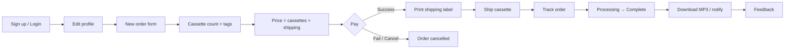
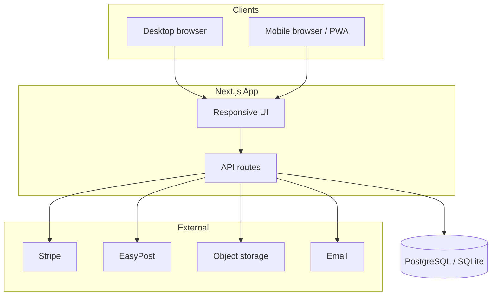

# ReelToDigit — Project Plan

Focused plan for the cassette-to-MP3 digitization portal: product scope, architecture (desktop + mobile), phased delivery, and implementation task list.

**Last updated:** 2026-07-20  
**Current phase:** P0 scaffold complete (demo payment & label stubs)

---

## 1. Product goal

Let customers create an account, place an order for cassette → MP3 conversion, pay (cassettes + shipping), print a shipping label, track the order, receive completion notice / downloads, and leave feedback.

### In scope

- Auth and editable profile (standard account details + shipping address)
- Dynamic order form: cassette count → per-cassette tag names
- Pricing: `(count × unit_price) + shipping`
- Shipping label generation / print
- Order lifecycle: submit / cancel → track → complete → feedback

### Out of scope (v1)

- Full digitization workstation UI (minimal admin status updater is enough)
- Real-time audio streaming / preview
- Multi-currency and complex tax engines (add later if needed)
- Native iOS / Android apps (responsive web + optional PWA first)

---

## 2. Core user journey



### Order statuses

| Status | Meaning |
|--------|---------|
| `draft` | Form started, not paid |
| `paid` | Payment captured |
| `label_ready` | Shipping label available |
| `in_transit` | Customer shipped / carrier scan |
| `received` | Lab received cassettes |
| `processing` | Digitization in progress |
| `completed` | MP3s ready |
| `cancelled` | User or system cancelled |
| `feedback_submitted` | Optional terminal after completed |

### Cancel policy (v1)

Free cancel while status is `draft`, `paid`, or `label_ready` (before in-transit). After that, support-mediated only.

---

## 3. Functional requirements

### 3.1 Account

- Register: name, email, password, optional phone
- Login / logout / password reset (reset = later phase if not in P0)
- Editable profile: contact + shipping address

### 3.2 Order form

- **Number of cassettes** (integer, min 1, max configurable, default 50)
- For each cassette: **tag name** (required; unique within order)
- Live **payment summary**: unit × count, shipping, total
- Actions: **Submit & pay** | **Cancel**

### 3.3 Shipping label

- After successful payment, generate label (customer → lab warehouse)
- Printable on desktop; open / share PDF or HTML on mobile
- Persist tracking number on the order

### 3.4 Tracking & completion

- Customer order list + detail with status timeline and tracking
- Staff (or webhook) advances status → `completed`
- On complete: notify customer; secure download links for MP3s (per cassette or ZIP)

### 3.5 Feedback

- Post-completion: rating (1–5) + optional comment
- One feedback per order

---

## 4. Technical architecture

### Decision: one responsive web app + shared API

| Layer | Choice | Rationale |
|-------|--------|-----------|
| Frontend | Next.js (React) + TypeScript + Tailwind | One codebase; strong desktop + mobile browser UX |
| Backend | Next.js Route Handlers | Fast to ship; extract Nest/FastAPI later if ops scale |
| DB | Prisma + SQLite (local) / PostgreSQL (prod) | Same schema; zero-friction local, durable prod |
| Auth | Auth.js (credentials + JWT) | Simple email/password; edge-safe middleware config |
| Payments | Stripe Checkout / Payment Element (P1) | PCI-light; works on mobile & desktop |
| Shipping | EasyPost or ShipStation (P1) | Labels + tracking webhooks |
| Files | S3-compatible storage + signed URLs (P2) | Secure MP3 delivery |
| Email | Resend / SES (P2) | Receipts, tracking, completion |
| Hosting | Vercel (web) + managed Postgres | Simple ops for v1 |

### Platform strategy



| Surface | Approach |
|---------|----------|
| Desktop | Multi-column forms, print CSS for labels, wider timeline |
| Mobile | Single-column, sticky price bar, touch-friendly count/tags, open/share label |
| PWA (v1.1) | Add to Home Screen for tracking without App Store |
| Native apps | Defer; reuse the same API when volume justifies |

### Data model (summary)

- `User` — profile + address + role (`customer` \| `admin`)
- `Order` — status, totals, timestamps
- `Cassette` — `orderId`, `tagName`, `sequence`
- `Payment` — provider refs, amount, status
- `ShippingLabel` — label URL, tracking number, carrier
- `MediaAsset` — completed MP3 paths per cassette/order
- `Feedback` — rating, comment, orderId
- `PricingConfig` — unit price, shipping, max cassettes

### Pricing rule (v1)

```
subtotal = cassetteCount × UNIT_PRICE
shipping = SHIPPING_FLAT   // or zone lookup later
total    = subtotal + shipping
```

Rates live in `PricingConfig` so ops can change without redeploy.

### Security

- Auth on all order / payment / download routes
- Signed, expiring download URLs (P2)
- Webhook signature verification (Stripe + carrier)
- Role-gated admin routes

---

## 5. Screens / UX map

1. Landing / marketing  
2. Sign up / Login  
3. Profile (editable)  
4. New order wizard: count → tags → review & pay  
5. Order confirmation + print label  
6. My orders + order detail (timeline, tracking, downloads)  
7. Feedback (after completed)  
8. Admin: list orders, update status, upload MP3s *(P2)*

---

## 6. Phased delivery

| Phase | Deliverable | Outcome | Status |
|-------|-------------|---------|--------|
| **P0** | Auth, profile, order form + pricing, demo pay, cancel, stub label, tracking UI, feedback form | Paying path exercisable end-to-end in demo | **Done** |
| **P1** | Stripe Checkout + webhooks; real shipping labels + tracking webhooks | Physical mail loop works | Planned |
| **P2** | Admin status + MP3 upload/download + completion emails | Real digitization ops | Planned |
| **P3** | Feedback polish, PWA, analytics, hardening | Retention & launch readiness | Planned |

---

## 7. Implementation task list

### Foundation — P0 ✅

- [x] Scaffold Next.js + TypeScript + Tailwind  
- [x] Env / config placeholders (Stripe, EasyPost, S3, lab address)  
- [x] Auth: register, login, logout  
- [x] User profile CRUD (editable form + address gate before order)  
- [x] Prisma schema + seed pricing  

### Order form & pricing — P0 ✅

- [x] Cassette count control  
- [x] Dynamic tag-name fields + validation  
- [x] Live price calculator  
- [x] Persist order + cassette rows  
- [x] Cancel order (pre–in-transit)  

### Payments — P0 stub / P1 real

- [x] Demo checkout marks paid + creates stub label (`POST /api/orders/:id/pay`)  
- [ ] Stripe Checkout (or Payment Element) from order total  
- [ ] Stripe webhook → mark `paid`, store payment ids  
- [ ] Payment failure / abandoned checkout handling  
- [ ] Email receipt  

### Shipping labels — P0 stub / P1 real

- [x] Printable HTML label + tracking stub  
- [ ] Integrate EasyPost / ShipStation (from address → lab)  
- [ ] Store real label PDF URL + tracking number; status `label_ready`  
- [ ] Desktop print + mobile open/share of PDF  
- [ ] Carrier tracking webhook → `in_transit` / `received`  

### Tracking & completion — P0 UI / P2 ops

- [x] Customer “My Orders” + order detail timeline  
- [x] Dev “Advance status” helper (local only)  
- [ ] Admin UI: update status (`received` → `processing` → `completed`)  
- [ ] Admin: upload MP3s (per cassette tag or ZIP) to object storage  
- [ ] Customer secure downloads + completion email/notification  

### Feedback & polish — P0 form / P3 polish

- [x] Feedback API + form post-completion  
- [ ] Responsive / mobile QA pass  
- [ ] Optional PWA manifest + offline order list  
- [ ] Basic observability: error logging, payment/shipping alerts  

### Hardening / launch — P3

- [ ] E2E tests: signup → order → pay → label → status → download → feedback  
- [ ] Rate limits, session hardening, signed URLs  
- [ ] Production deploy + runbook (refunds, failed labels, re-upload)  
- [ ] Switch Prisma provider to PostgreSQL; strong `AUTH_SECRET`  

---

## 8. Defaults locked for build

| Decision | Default |
|----------|---------|
| Product name | ReelToDigit |
| Stack | Next.js + Prisma + Auth.js + Tailwind |
| Clients | Responsive web (+ PWA later); no native v1 |
| Local DB | SQLite (`file:./dev.db`) |
| Prod DB | PostgreSQL |
| Unit price (seed) | $15.00 / cassette |
| Shipping (seed) | $8.99 flat |
| Cancel | Free until in transit |
| Admin | Same app, `User.role === "admin"` (P2) |

---

## 9. Open decisions

Confirm before or during P1/P2:

1. Final unit price and shipping (flat vs zone-based)?  
2. Lab / warehouse address for labels?  
3. MP3 delivery: per-cassette files vs one ZIP?  
4. Keep Auth.js credentials vs managed auth (Clerk / Auth0)?  
5. English only for v1, or multi-language?  
6. Preferred shipping provider: EasyPost vs ShipStation vs carrier-direct?  

---

## 10. Repo map (P0)

```
prisma/                 Schema + seed
src/app/                Pages + API routes
src/components/         Forms, timeline, header
src/lib/                Auth, Prisma, pricing, validation
docs/PROJECT_PLAN.md    This document
README.md               Run instructions
```

See [README.md](../README.md) for quick start and current API surface.

---

## 11. Suggested next step

**Start P1:** replace demo `/pay` with Stripe Checkout and stub label HTML with EasyPost (or ShipStation) label PDFs + tracking webhooks.
